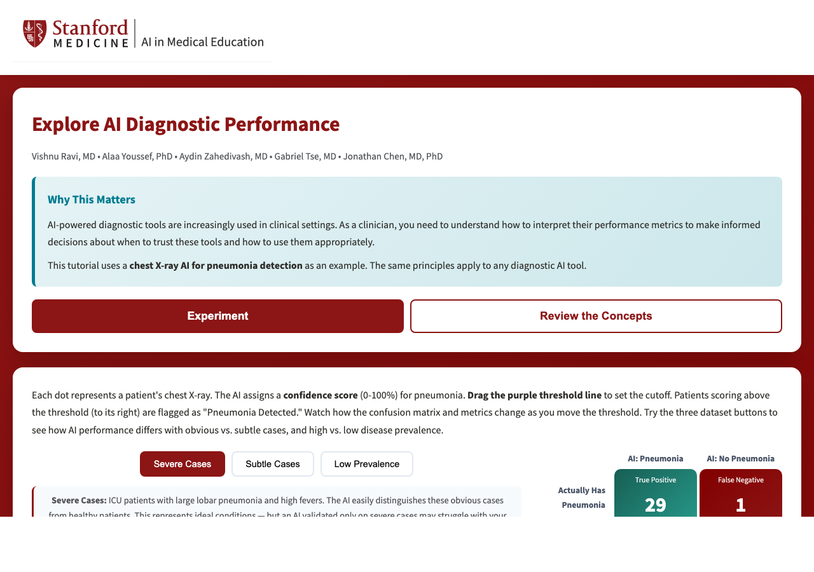
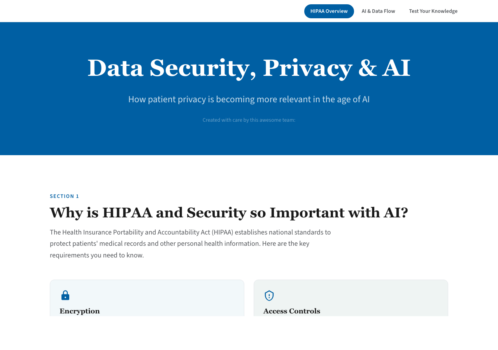

# Stanford AI in Medical Education Open-Access Tools

Interactive learning modules from the [Stanford Medicine AI in Medical Education](https://med.stanford.edu/ai-in-meded.html) program. Deployed to GitHub Pages at [stanfordmed.github.io/aimeded](https://stanfordmed.github.io/aimeded/).

## Modules

### Explore AI Diagnostic Performance

An interactive tool for teaching clinicians how to interpret AI diagnostic metrics using a chest X-ray pneumonia detection example. Features an adjustable threshold slider, ROC and Precision-Recall curves, prevalence effects, and clinical scenario questions.



### Data Security & AI: A HIPAA Module

Explore data security fundamentals, HIPAA regulations, and responsible use of AI tools in clinical settings through interactive scenarios, drag-and-drop exercises, and knowledge checks.



## Development

### AI Evaluation module

Open `AIEvaluation/index.html` directly in a browser. No build step needed.

### Data Security module

```bash
cd "Data Security Module v3"
npm install
npm run dev
```

### Deployment

Pushing to `main` triggers a [GitHub Actions workflow](.github/workflows/deploy.yml) that builds the Data Security module, assembles both modules with the landing page, and deploys to GitHub Pages.

